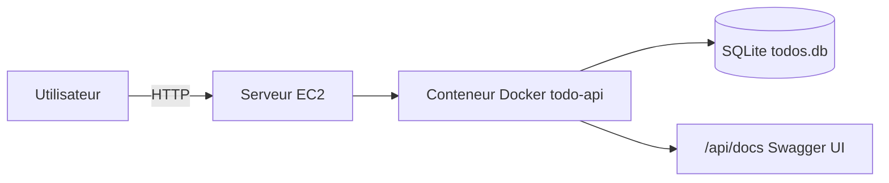
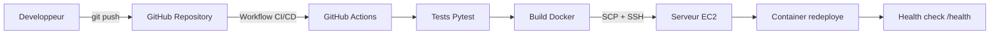

# DAT - Todo API

## 1. Presentation du projet

Ce projet deploie une API REST Todo en production avec un pipeline CI/CD automatise.

Objectif principal:

- Fournir une application simple, fonctionnelle et accessible en ligne.
- Industrialiser le cycle de deploiement de bout en bout.

Application:

- Backend: Flask (Python)
- Base de donnees: SQLite
- Documentation API: Swagger UI
- Conteneurisation: Docker
- CI/CD: GitHub Actions
- Hebergement cible: EC2 (Docker sur VM)

## 2. Architecture technique

### 2.1 Vue d'ensemble



### 2.2 Flux de deploiement



## 3. Composants

- `app.py`
  - Expose l'API `/api/v1/todos`
  - Expose `/health` pour verifier la disponibilite de l'application
  - Sert Swagger via `/api/docs`
- `Dockerfile`
  - Build de l'image Python
  - Demarrage de l'app sur le port 9090
- `.github/workflows/deploy.yml`
  - Pipeline CI/CD complet (test, build, deploy)
- `tests/test_app.py`
  - Tests unitaires/fonctionnels de base de l'API

## 4. Pipeline CI/CD

Declencheurs:

- Push sur la branche `main`
- Pull Request vers `main`

Etapes:

1. `test`
   - Installation des dependances
   - Execution des tests `pytest`
2. `build-image`
   - Construction de l'image Docker
3. `deploy` (uniquement sur push `main`)
   - Copie du projet vers EC2
   - Reconstruction de l'image sur EC2
   - Redemarrage du conteneur
   - Montage d'un volume Docker pour persister la base SQLite
   - Verification de disponibilite via `/health`

Secrets GitHub Actions requis:

- `EC2_HOST`
- `EC2_USER`
- `SSH_PRIVATE_KEY`

## 5. Choix techniques et justifications

- Flask:
  - Framework leger et rapide a mettre en place pour une API CRUD simple.
- SQLite:
  - Suffisant pour un projet pedagogique sans complexite de gestion d'un SGBD externe.
- Docker:
  - Garantit un environnement d'execution reproductible entre local et production.
- GitHub Actions:
  - Automatisation native simple, lisible et maintenable pour CI/CD.
- Deploiement EC2 par SSH:
  - Approche directe et facile a expliquer, adaptee a l'objectif d'une chaine complete fonctionnelle.

## 6. Exploitation et acces

Variables d'environnement importantes:

- `DB_PATH` (optionnel): chemin du fichier SQLite.
  - Valeur de production recommandee: `/app/data/todos.db`

Ports:

- Application dans le conteneur: `9090`
- Exposition publique sur EC2: `9090`

URL de production:

- API: `http://<EC2_HOST>:9090/api/v1/todos`
- Health check: `http://<EC2_HOST>:9090/health`
- Swagger: `http://<EC2_HOST>:9090/api/docs`

Identifiants:

- Aucun identifiant requis pour cette version (API ouverte).

## 7. Procedure de runbook rapide

### Local

```bash
python -m venv .venv
source .venv/bin/activate
pip install -r requirements.txt
python app.py
```

### Docker local

```bash
docker build -t todo-api .
docker run --rm -p 9090:9090 -e PORT=9090 -e DB_PATH=/app/data/todos.db -v todo_api_data:/app/data todo-api
```

### Tests

```bash
pytest -q
```

## 8. Limites connues et ameliorations

- SQLite convient pour un faible trafic; pour monter en charge, migrer vers PostgreSQL.
- La securisation (authentification, HTTPS termine sur reverse proxy) est a ajouter pour un contexte production reel.
- Ajouter des tests complementaires (cas d'erreur supplementaires, tests de non regression) selon les besoins.
